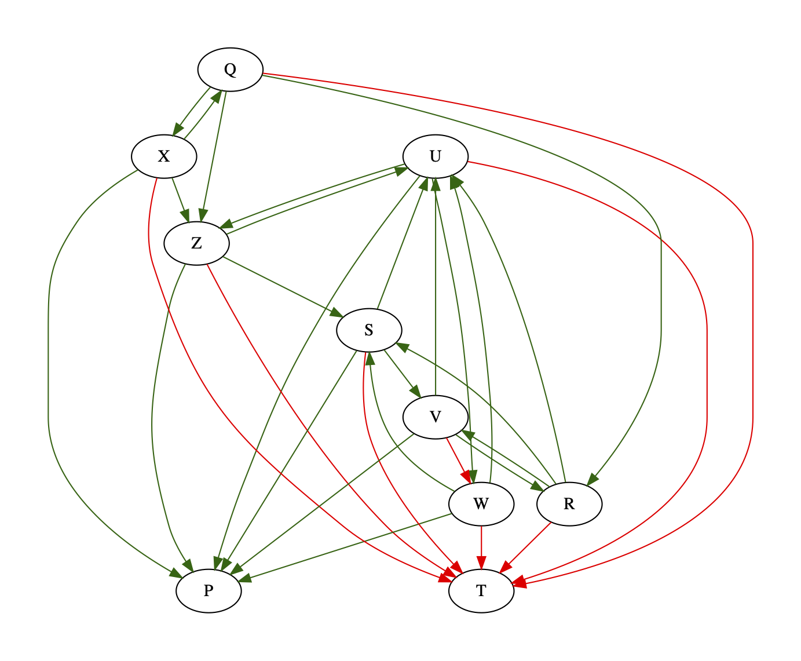

# Team Selector

I need to make student teams of 2 in my classes for which I ask students to specify _greens_ and _reds_. Greens are people that the student wants to work with and reds are people that they _do not_ want to work with. This program matches students according to these preferences.

## How to Use

Enter your data in the file, `preferences.csv`. A sample is provided. The details of the required format are given below.

The first row contains titles. The first title indicates a student and may be left blank. The remaining titles are any number of _green_ and _red_ in any order.

Each remaining row contains the preferences of an individual student, the _source_ for that row. The name of the source appears in the first column. Each cell in a column titled _green_ contains the name of a different student that _source_ wants to work with. Each cell in a column titled _red_ contains the name of a different student that _source_ does not want to work with.

Different students may have different numbers or greens and reds. Leave cells blank for missing data. The program accounts for all students indicated as a source, a green, or a red. Students who have not been indicated as either of these but still need to be matched should be added in the file as sources with no data for greens or reds.

Make sure to use a unique name for each student and to use the name consistently. Take care to not mistype it as the program currently cannot account for typos.

The set of students indicated as sources, greens, and reds __must have an even size__.

## The Computed Matching

The program _matches_ each student according to their preference. The set of all matches is called a _matching_. The program computes many matchings and outputs the one with the highest _goodness score_ which is between 0 (worst) and 1 (best). The matching score is a measure of the number of students in the matching who are matched with a green. If no matching can be found, the output score is negative.

Because the programs makes matches of 2, the total number of specified students __must be even__.

As it is usually impossible to meet all preferences, a score of 0.6 or above is good enough.

## The Visualization

The program outputs a graph visualizing the preferences.

## Requirements

To run the program,

- you need at least python 3.8 because of the use of _assignment expressions_. Update your python from https://www.python.org.
- you need the `colorama` package because of its use for colored output. Run `pip install colorama` or `pip3 install colorama`, depending on your platform, if it is not installed.
- you need the `graphviz` package because of its use for visualization. Run `pip install graphviz` or `pip3 install graphviz`, depending on your platform, if it is not installed.

## How it Works

The problem is modeled as a directed graph with every student as a node, green edges from a student to their greens and red edges from a student to their reds. The program tries to partition the vertices into pairs or _matches_ such that no match contains a red and as many greens are included in the matches as possible.

The program builds a matching by iteratively picking a random node as the _source_ and building a match with one of its greens such that _source_ is not a red of the green. If a match cannot be found among the greens, nodes not connected to _source_ are searched for matches. If still no match is found, the matching fails. Once a match is found, _source_ and its match are added to the matching and removed from the graph.

As random choices are involved, the above process is repeated several times to maximize the likelihood of a high scoring pairing. The highest scoring pairings (there may be multiple) are saved.

### Visualization

The program saves and launches a visualization of the graph. The generated file name is `preferences.pdf`.

### Sample Output

Provided that the requriemetns are met, the given program shoud run with the given `preferences.csv` file as-is. The produced output will be of the form
```
>>> main()
Read preferences of 10 students with up to 3 greens and 1 reds.
progress: [########################################]
(P, T), (Q, X), (R, V), (S, W), (U, Z)
0.875
```

- The first line of the output contains summary information of the data read from `preferences.csv`.
- The second line is a progress bar which updates while the program is still trying to find a better match.
- The third line shows the highest scoring matching found. This may differ for you.
- The last line of the output shows how well the matching scored.
- A visualization like the following will also launch. Note that your visualization may vary depending on your computed matching.


## Limitations

- It may be possible for a set of preferences to not lead to any possible matching. That has to be studied.
- I have not considered how this works for an odd number of students. The program could be run for an even number of students, leaving one student out, and that remaining student could be inserted manually into a computed pair.

## Extensions

This is probably a variant of the _vertex cover_ problem. If so, a more efficient and theoretically sound solution may exist.

## Bugs

The program fails or crashes? You have found an error? You want to know more? This documentation sucks?

For the above or any other issues, please report
- to <wsaleem@gmail.com>, or
- to <waqar.saleem@sse.habib.edu.pk>, or
- by seeing me in C-103, or
- by calling me at 5223, or
- by fixing it yourself and submitting a Pull Request :)
